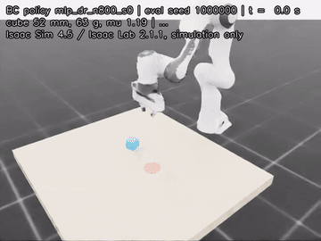

# isaac-skill-lab

Skill training and evaluation for a household-style pick-and-place skill ("put the block on the coaster")
in **NVIDIA Isaac Sim 4.5 / Isaac Lab 2.1.1**: my own scene, robot and controller setup, a scripted expert
that collects demonstrations across 1024 parallel environments, behaviour-cloning policies, and an evaluation
harness with held-out seeds, confidence intervals, paired tests, robustness shifts and a domain-randomization
ablation.



**Simulation only. No real robot was used and no sim-to-real claim is made.**

## What is in here

| step | file | what it does |
|---|---|---|
| scene + robot | `skilllab/sim/env.py` | Franka Panda on a box table, a cube (40 to 60 mm, randomized) and a coaster disc. Own `InteractiveSceneCfg`, not a copy of a registered task. Cube size is set per environment on the USD stage before the simulation starts; mass and friction are set per episode through the PhysX tensor API |
| controller | `skilllab/sim/env.py`, [docs/CONTROLLER.md](docs/CONTROLLER.md) | task-space actions (TCP position and yaw increments + gripper) -> damped-least-squares differential IK (`isaaclab.controllers.DifferentialIKController`) at 100 Hz on a TCP-shifted Jacobian -> joint PD. Gains chosen from a measured sweep (`scripts/tune_controller.py`) |
| expert | `skilllab/expert.py` | vectorized 8-phase state machine (approach, descend, grasp, lift, transport, lower, release, retreat) with regrasp on a drop; reads only the observation |
| data | `scripts/collect.py`, `skilllab/dataset.py` | 1024 parallel envs, DART-style execution noise with clean labels, successful episodes kept, robomimic-style HDF5 (`data/demo_i/obs/<key>`, `actions`, `rewards`, `dones`, `mask/train`, `mask/valid`) |
| training | `scripts/train.py`, `skilllab/models.py` | BC-MLP (3 x 256) and BC-RNN (2-layer GRU, horizon 10, as in robomimic); MSE on standardized TCP deltas + BCE on the gripper; 3 seeds per config |
| evaluation | `scripts/evaluate.py`, `skilllab/stats.py` | 200 held-out seeds, identical episodes for every agent (paired), Wilson 95% CIs, exact McNemar tests, time to success, 6 shifted conditions + a size shift + a no-DR world |
| failure analysis | `scripts/diagnose_failures.py` | classifies failed episodes (never lifted, misplaced, not released) and detects stalls |
| report | `scripts/make_report.py` | writes [docs/RESULTS.md](docs/RESULTS.md), `results/summary.json` and the table below from `results/*.json` only |

Observations are state-based (16 values: TCP position, gripper width, cube position, cube relative to TCP,
cube-to-gripper yaw error, coaster position, coaster relative to cube, cube size). No camera input.

## Results

<!-- results:start (generated by scripts/make_report.py) -->

_NVIDIA L4, Isaac Sim 4.5 / Isaac Lab 2.1.1, simulation only, no real robot. 200 held-out episodes per policy; policy rows pool 3 training seeds._

| what | result |
|---|---|
| BC-MLP, 25 demos | 40.8% (245/600, CI 37.0% to 44.8%) |
| BC-MLP, 50 demos | 76.5% (459/600, CI 72.9% to 79.7%) |
| BC-MLP, 100 demos | 87.3% (524/600, CI 84.4% to 89.8%) |
| BC-MLP, 200 demos | 92.8% (557/600, CI 90.5% to 94.6%) |
| BC-MLP, 400 demos | 99.0% (594/600, CI 97.8% to 99.5%) |
| BC-MLP, 800 demos | 100.0% (600/600, CI 99.4% to 100.0%) |
| scripted expert (teacher) | 100.0% (200/200, CI 98.1% to 100.0%) |
| BC-RNN, 100 demos | 99.8% (599/600, CI 99.1% to 100.0%); vs MLP p = 5.3e-23 |
| BC-RNN, 400 demos | 100.0% (600/600, CI 99.4% to 100.0%); vs MLP p = 0.031 |
| DR vs no-DR on DR ranges (nominal) | 99.0% vs 75.0%, p = 7.7e-39 |
| DR vs no-DR on heavy and slippery | 98.3% vs 70.0%, p = 1.1e-43 |
| DR vs no-DR on wide pose | 94.8% vs 74.5%, p = 3.6e-23 |
| DR vs no-DR on small cubes | 94.8% vs 19.3%, p = 6.3e-130 |
| DR vs no-DR on no-DR world (fixed physics) | 99.7% vs 99.3%, p = 0.69 |
| BC-MLP 800 demos, `wide_pose` | 99.3% (596/600, CI 98.3% to 99.7%) |
| BC-MLP 800 demos, `heavy_slippery` | 100.0% (600/600, CI 99.4% to 100.0%) |
| BC-MLP 800 demos, `obs_noise_5mm` | 99.7% (598/600, CI 98.8% to 99.9%) |
| BC-MLP 800 demos, `action_delay_1` | 7.5% (45/600, CI 5.7% to 9.9%) |
| BC-MLP 800 demos, `action_delay_2` | 0.0% (0/600, CI 0.0% to 0.6%) |
| BC-MLP 800 demos, `small_cubes` | 99.8% (599/600, CI 99.1% to 100.0%) |
| scripted expert, `action_delay_1` | 3.5% (7/200, CI 1.7% to 7.0%) |
| scripted expert, `action_delay_2` | 0.0% (0/200, CI 0.0% to 1.9%) |
| demos kept (DR) | 1004 / 1024 (98.0%) |
| total BC training time, all runs | 16.0 min |

<!-- results:end -->


What the numbers say (details and per-seed values in [docs/RESULTS.md](docs/RESULTS.md)):

- **Data scaling**: BC-MLP success rises steeply up to a few hundred demos and saturates at the expert's level.
- **Model**: BC-RNN (GRU over 10-step windows) is clearly more data efficient than the MLP at 100 demos.
- **Domain randomization** matters on every shifted test world and costs nothing on the fixed-physics world
  the no-DR policy was trained in. The biggest gap is on cubes smaller than anything in training.
- **Failure mode**: most BC failures are stalls before the grasp (the policy settles where it outputs almost no
  motion); small observation noise breaks these stalls, see section 8 of the results.
- **Weak spot**: 50 to 100 ms of actuation delay breaks the expert and every policy, because the
  increment-based action interface plus a proportional outer loop oscillates. This is a property of the
  controller interface, not of the learning ([docs/CONTROLLER.md](docs/CONTROLLER.md)).
- **Controller tuning**: open-loop step response alone picked gains that dropped the expert's closed-loop success;
  the final gains were chosen on closed-loop skill success.

Full tables (per seed, time to success, all conditions, controller sweep, training times):
[docs/RESULTS.md](docs/RESULTS.md).

## How to run

Needs an NVIDIA GPU, Isaac Sim 4.5 pip wheels and an Isaac Lab 2.1.1 checkout installed into one Python 3.10
venv (`pip install isaacsim[all,extscache]==4.5.0` then `./isaaclab.sh --install` from the Isaac Lab
checkout). Point `IPY` at that interpreter.

```bash
make smoke   IPY=/path/to/venv/bin/python   # scene + expert on 16 envs
make collect                                # DR and no-DR demos (1024 envs each)
make train                                  # 27 BC runs
make tune                                   # controller sweep
make eval                                   # 3 evaluation worlds
make diagnose                               # failure-mode analysis
make video                                  # camera render of one policy
make report                                 # docs/RESULTS.md + README table
make gate                                   # ruff + pytest (pure-Python parts)
```

Headless notes: `OMNI_KIT_ACCEPT_EULA=YES` accepts the Omniverse EULA, `--enable_cameras` is needed for the
video, and the scripts exit the process directly after writing their outputs because Kit's shutdown hook
can hang in a headless session.

## Limitations

- Simulation only (PhysX in Isaac Sim). Nothing here has run on a real Franka.
- State-based observations with exact object poses; a real system would need perception, and the
  `obs_noise_5mm` condition is only a rough proxy for that.
- Demonstrations come from a scripted state machine, not human teleoperation, so they are cleaner and more
  consistent than real demos. Isaac Lab's Mimic tooling, teleoperation and GR00T-style foundation-model
  post-training are not used.
- One rigid cube and one target type. Domain randomization covers pose, size, mass and friction, not visuals.
- The delta-action interface is sensitive to actuation delay; see `action_delay_*` in the results and
  [docs/CONTROLLER.md](docs/CONTROLLER.md).
- GPU PhysX is not bit-reproducible: rerunning an evaluation changes failure counts by about one or two
  episodes in 200.
- Pooled confidence intervals treat episodes from 3 training seeds as independent; per-seed rates are
  reported next to them.

## License

MIT, see [LICENSE](LICENSE). Isaac Sim and Isaac Lab are subject to their own licenses.
