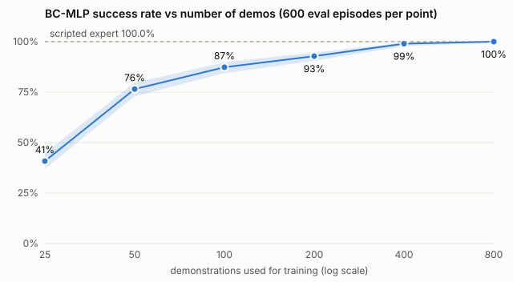

# Results

Setup: **NVIDIA L4, Isaac Sim 4.5 / Isaac Lab 2.1.1, simulation only, no real robot**. Generated by `scripts/make_report.py` from `results/*.json`; do not edit by hand.

## 1. Demonstration collection (scripted expert, parallel envs)

| dataset | kept / attempted | kept rate | mean length (steps at 20 Hz) | expert time to success | demos with a regrasp | samples | rollout wall time |
|---|---|---|---|---|---|---|---|
| dr | 1004 / 1024 | 98.0% | 134.6 | 5.49 s | 48 | 135172 | 6.9 s (1024 envs) |
| no_dr | 1000 / 1024 | 97.7% | 136.4 | 5.58 s | 72 | 136432 | 6.9 s (1024 envs) |

Executed actions carry Gaussian noise (DART-style) while the clean expert action is stored as the label; only successful episodes are kept, trimmed 1 s after success.

## 2. Controller tuning (DLS differential IK + joint PD)

| DLS lambda | stiffness | damping | rise 10-90% | overshoot | settled error | ramp RMS error | ramp final lag |
|---|---|---|---|---|---|---|---|
| 0.01 | 80 | 4 | 0.18 s | 18.0 mm | 28.4 mm | 66.8 mm | 51.8 mm |
| 0.01 | 400 | 40 | 0.21 s | 0.0 mm | 0.0 mm | 39.3 mm | 37.5 mm |
| 0.01 | 400 | 80 | 0.41 s | 0.0 mm | 0.1 mm | 59.8 mm | 76.2 mm |
| 0.01 | 1000 | 100 | 0.22 s | 0.0 mm | 0.0 mm | 35.5 mm | 38.1 mm |
| 0.01 | 1000 | 200 | 0.43 s | 0.0 mm | 0.1 mm | 57.2 mm | 74.3 mm |
| 0.05 | 80 | 4 | 0.18 s | 18.6 mm | 27.2 mm | 67.1 mm | 52.0 mm |
| 0.05 | 400 | 40 | 0.21 s | 0.0 mm | 0.0 mm | 39.7 mm | 38.3 mm |
| 0.05 **(chosen)** | 400 | 80 | 0.43 s | 0.0 mm | 0.1 mm | 60.2 mm | 77.2 mm |
| 0.05 | 1000 | 100 | 0.23 s | 0.0 mm | 0.0 mm | 35.9 mm | 38.8 mm |
| 0.05 | 1000 | 200 | 0.45 s | 0.0 mm | 0.1 mm | 57.7 mm | 75.2 mm |
| 0.2 | 80 | 4 | 0.21 s | 25.3 mm | 10.1 mm | 70.7 mm | 61.2 mm |
| 0.2 | 400 | 40 | 0.32 s | 0.0 mm | 0.0 mm | 45.8 mm | 49.0 mm |
| 0.2 | 400 | 80 | 0.71 s | 0.0 mm | 1.8 mm | 66.5 mm | 89.6 mm |
| 0.2 | 1000 | 100 | 0.35 s | 0.0 mm | 0.0 mm | 42.0 mm | 48.8 mm |
| 0.2 | 1000 | 200 | 0.72 s | 0.0 mm | 1.9 mm | 64.2 mm | 87.5 mm |

Closed loop: scripted expert running the whole skill with each gain pair (DLS lambda 0.05, DR ranges, no action noise):

| stiffness | damping | expert success (Wilson 95% CI) | mean time to success |
|---|---|---|---|
| 80 | 4 | 0.0% (0/100, CI 0.0% to 3.7%) | n/a |
| 400 | 40 | 66.0% (66/100, CI 56.3% to 74.5%) | 4.06 s |
| 400 **(chosen)** | 80 | 100.0% (100/100, CI 96.3% to 100.0%) | 4.77 s |
| 1000 | 100 | 99.0% (99/100, CI 94.6% to 99.8%) | 3.21 s |
| 1000 | 200 | 100.0% (100/100, CI 96.3% to 100.0%) | 4.72 s |

Why 400 / 80 although 400 / 40 tracks steps faster: see [CONTROLLER.md](CONTROLLER.md).

## 3. Training

| config | runs | train samples (mean) | train time per run (mean) | valid loss (mean) | gripper accuracy on valid (mean) | params |
|---|---|---|---|---|---|---|
| mlp_dr_n25 | 3 | 3397 | 30.7 s | 0.3837 | 99.1% | 137221 |
| mlp_dr_n50 | 3 | 6760 | 30.2 s | 0.1880 | 99.3% | 137221 |
| mlp_dr_n100 | 3 | 13449 | 30.7 s | 0.1182 | 99.5% | 137221 |
| mlp_dr_n200 | 3 | 26942 | 31.3 s | 0.0907 | 99.6% | 137221 |
| mlp_dr_n400 | 3 | 53804 | 30.4 s | 0.0675 | 99.8% | 137221 |
| mlp_dr_n800 | 3 | 108001 | 30.5 s | 0.0539 | 99.8% | 137221 |
| mlp_no_dr_n400 | 3 | 54585 | 30.7 s | 0.0838 | 99.5% | 137221 |
| rnn_dr_n100 | 3 | 12549 | 52.7 s | 0.1222 | 99.3% | 795141 |
| rnn_dr_n400 | 3 | 50204 | 52.1 s | 0.0487 | 99.7% | 795141 |

All runs: 20000 AdamW steps, batch 256, cosine LR from 0.001, on NVIDIA L4. Total training time for all 27 runs: 16.0 min.

## 4. Data scaling (held-out seeds, 200 episodes x 3 training seeds per point)

| demos | success (pooled, Wilson 95% CI) | per-seed rates | mean time to success |
|---|---|---|---|
| 25 | 40.8% (245/600, CI 37.0% to 44.8%) | 54.0%, 32.5%, 36.0% | 5.21 s |
| 50 | 76.5% (459/600, CI 72.9% to 79.7%) | 77.0%, 78.0%, 74.5% | 4.98 s |
| 100 | 87.3% (524/600, CI 84.4% to 89.8%) | 86.5%, 87.0%, 88.5% | 5.01 s |
| 200 | 92.8% (557/600, CI 90.5% to 94.6%) | 92.5%, 94.0%, 92.0% | 4.99 s |
| 400 | 99.0% (594/600, CI 97.8% to 99.5%) | 100.0%, 98.5%, 98.5% | 4.80 s |
| 800 | 100.0% (600/600, CI 99.4% to 100.0%) | 100.0%, 100.0%, 100.0% | 4.75 s |
| scripted expert | 100.0% (200/200, CI 98.1% to 100.0%) | - | 4.80 s |

Pooled intervals treat the 3 x 200 episodes as independent and so do not include training-seed variance; the per-seed column shows that spread.

## 5. BC-MLP vs BC-RNN (same demos, same eval seeds, paired)

| demos | BC-MLP | BC-RNN | McNemar exact p (pooled pairs) |
|---|---|---|---|
| 100 | 87.3% (524/600, CI 84.4% to 89.8%) | 99.8% (599/600, CI 99.1% to 100.0%) | 5.3e-23 (MLP-only 0, RNN-only 75) |
| 400 | 99.0% (594/600, CI 97.8% to 99.5%) | 100.0% (600/600, CI 99.4% to 100.0%) | 0.031 (MLP-only 0, RNN-only 6) |

## 6. Robustness under shifted conditions

Each cell: success rate (successes/episodes, Wilson 95% CI). Policies: 3 training seeds x 200 episodes pooled; expert: 200 episodes.

- `nominal`: training distribution (DR ranges)
- `wide_pose`: cube and coaster sampled from a 1.6x larger area
- `heavy_slippery`: mass and friction outside the training ranges
- `obs_noise_5mm`: sigma 5 mm on cube and coaster positions
- `action_delay_1`: actions applied one policy step (50 ms) late
- `action_delay_2`: actions applied two policy steps (100 ms) late
- `small_cubes`: edge 32 to 40 mm, below the 40 to 60 mm training range (separate simulator process)

| agent | nominal | wide_pose | heavy_slippery | obs_noise_5mm | action_delay_1 | action_delay_2 | small_cubes |
|---|---|---|---|---|---|---|---|
| scripted expert | 100.0% (200/200 CI 98.1% to 100.0%) | 100.0% (200/200 CI 98.1% to 100.0%) | 100.0% (200/200 CI 98.1% to 100.0%) | 100.0% (200/200 CI 98.1% to 100.0%) | 3.5% (7/200 CI 1.7% to 7.0%) | 0.0% (0/200 CI 0.0% to 1.9%) | 100.0% (200/200 CI 98.1% to 100.0%) |
| BC-MLP, 400 DR demos | 99.0% (594/600 CI 97.8% to 99.5%) | 94.8% (569/600 CI 92.8% to 96.3%) | 98.3% (590/600 CI 97.0% to 99.1%) | 99.3% (596/600 CI 98.3% to 99.7%) | 18.8% (113/600 CI 15.9% to 22.2%) | 0.3% (2/600 CI 0.1% to 1.2%) | 94.8% (569/600 CI 92.8% to 96.3%) |
| BC-MLP, 800 DR demos | 100.0% (600/600 CI 99.4% to 100.0%) | 99.3% (596/600 CI 98.3% to 99.7%) | 100.0% (600/600 CI 99.4% to 100.0%) | 99.7% (598/600 CI 98.8% to 99.9%) | 7.5% (45/600 CI 5.7% to 9.9%) | 0.0% (0/600 CI 0.0% to 0.6%) | 99.8% (599/600 CI 99.1% to 100.0%) |
| BC-RNN, 400 DR demos | 100.0% (600/600 CI 99.4% to 100.0%) | 99.8% (599/600 CI 99.1% to 100.0%) | 100.0% (600/600 CI 99.4% to 100.0%) | 100.0% (600/600 CI 99.4% to 100.0%) | 4.8% (29/600 CI 3.4% to 6.9%) | 0.0% (0/600 CI 0.0% to 0.6%) | 100.0% (600/600 CI 99.4% to 100.0%) |
| BC-MLP, 400 no-DR demos | 75.0% (450/600 CI 71.4% to 78.3%) | 74.5% (447/600 CI 70.9% to 77.8%) | 70.0% (420/600 CI 66.2% to 73.5%) | 99.0% (594/600 CI 97.8% to 99.5%) | 9.3% (56/600 CI 7.3% to 11.9%) | 0.0% (0/600 CI 0.0% to 0.6%) | 19.3% (116/600 CI 16.4% to 22.7%) |

Paired McNemar tests, nominal vs shifted condition (same seeds), BC-MLP 800 DR demos:

| condition | nominal-only successes | shifted-only successes | exact p |
|---|---|---|---|
| wide_pose | 4 | 0 | 0.12 |
| heavy_slippery | 0 | 0 | 1 |
| obs_noise_5mm | 2 | 0 | 0.5 |
| action_delay_1 | 555 | 0 | 1.7e-167 |
| action_delay_2 | 600 | 0 | 4.8e-181 |

## 7. Domain randomization vs none (BC-MLP, 400 demos each, paired by seed)

The no-DR dataset keeps the pose randomization but fixes cube size (50 mm), mass (100 g) and friction (0.8).

| test world | trained with DR | trained without DR | DR-only / no-DR-only successes | McNemar exact p |
|---|---|---|---|---|
| DR ranges (nominal) | 99.0% (594/600, CI 97.8% to 99.5%) | 75.0% (450/600, CI 71.4% to 78.3%) | 148 / 4 | 7.7e-39 |
| heavy and slippery | 98.3% (590/600, CI 97.0% to 99.1%) | 70.0% (420/600, CI 66.2% to 73.5%) | 177 / 7 | 1.1e-43 |
| wide pose | 94.8% (569/600, CI 92.8% to 96.3%) | 74.5% (447/600, CI 70.9% to 77.8%) | 144 / 22 | 3.6e-23 |
| small cubes | 94.8% (569/600, CI 92.8% to 96.3%) | 19.3% (116/600, CI 16.4% to 22.7%) | 457 / 4 | 6.3e-130 |
| no-DR world (fixed physics) | 99.7% (598/600, CI 98.8% to 99.9%) | 99.3% (596/600, CI 98.3% to 99.7%) | 4 / 2 | 0.69 |

## 8. Failure modes (separate diagnostic rerun on the same seeds)

| policy | condition | failures | never lifted | lifted, not on coaster | on coaster, not released or not resting | failures with a stalled TCP (last 2 s) |
|---|---|---|---|---|---|---|
| mlp_dr_n100_s0 | nominal | 26/200 | 22 | 2 | 2 | 18 |
| mlp_dr_n100_s0 | obs_noise_5mm | 12/200 | 6 | 1 | 5 | 0 |
| mlp_dr_n100_s1 | nominal | 25/200 | 18 | 3 | 4 | 16 |
| mlp_dr_n100_s1 | obs_noise_5mm | 11/200 | 5 | 3 | 3 | 1 |
| mlp_dr_n100_s2 | nominal | 23/200 | 17 | 4 | 2 | 14 |
| mlp_dr_n100_s2 | obs_noise_5mm | 14/200 | 13 | 0 | 1 | 0 |
| mlp_no_dr_n400_s0 | nominal | 62/200 | 58 | 1 | 3 | 60 |
| mlp_no_dr_n400_s0 | obs_noise_5mm | 1/200 | 0 | 1 | 0 | 1 |
| mlp_no_dr_n400_s1 | nominal | 32/200 | 26 | 5 | 1 | 30 |
| mlp_no_dr_n400_s1 | obs_noise_5mm | 3/200 | 1 | 1 | 1 | 1 |
| mlp_no_dr_n400_s2 | nominal | 58/200 | 53 | 1 | 4 | 54 |
| mlp_no_dr_n400_s2 | obs_noise_5mm | 2/200 | 1 | 0 | 1 | 0 |

Most BC failures are stalls before the grasp: the policy settles into a fixed point where it outputs almost no motion. Observation noise shakes it out of that point, which is why `obs_noise_5mm` scores higher than `nominal` for the weaker policies. GPU PhysX is not bit-reproducible, so failure counts in this rerun can differ by one or two episodes from section 6.

## 9. Video

`media/policy_rollouts.mp4`: policy `mlp_dr_n800_s0` on 4 held-out seeds, rendered with an Isaac Lab camera; 4/4 of the filmed episodes succeed.

